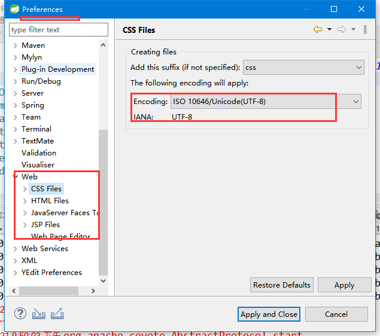
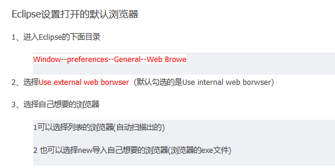
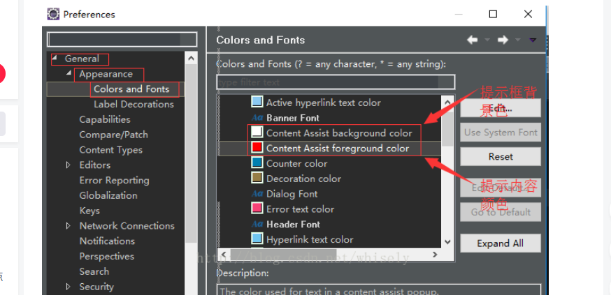

## 编码

### 字符集更改



### 浏览器更改



## alt+/代码提示框颜色调整




## 没有代码提示


```java
STS		Windows		→	Preferences		→	Java→Editor		→		Content Assist
    修改Auto Activation triggers for java的值为：.abc 点击apply按钮
        
// https://blog.csdn.net/weixin_40816738/article/details/94998794        
```


## 设置自动生成getter/setter

```java
右键 -- sources -- generate
```


## 关闭命名提示——自动添加后缀

```java
window -> Preference ->Java -> Editor -> Content Assist 
至此，勾选上部 Disable insertion triggers except 'Enter'
```


## eclipse.ini

```java
```

## 选择 java 透视图， 如何调整 javaEE

```java
// 这个是什么原因？ 该怎么处理？ 还是 eclipse 特有的
```

## 查看源代码

