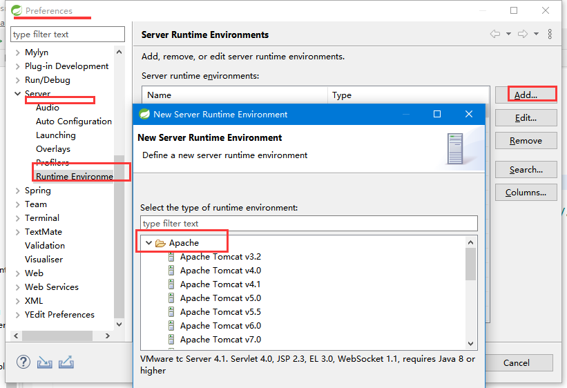
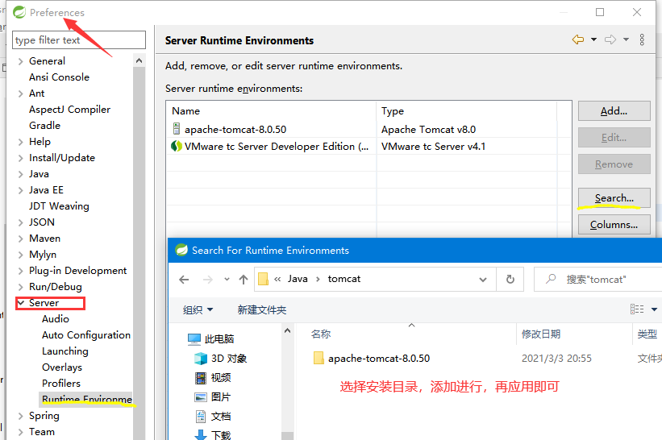
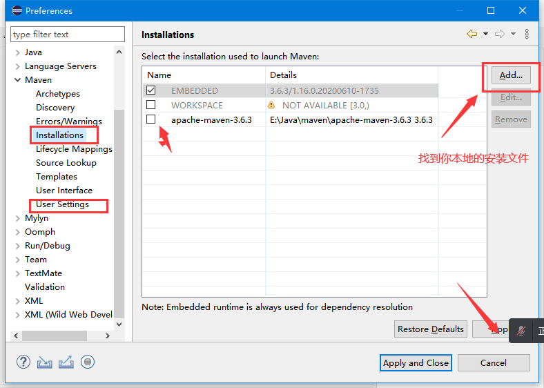
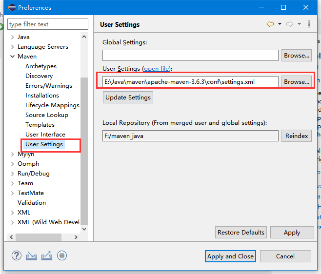
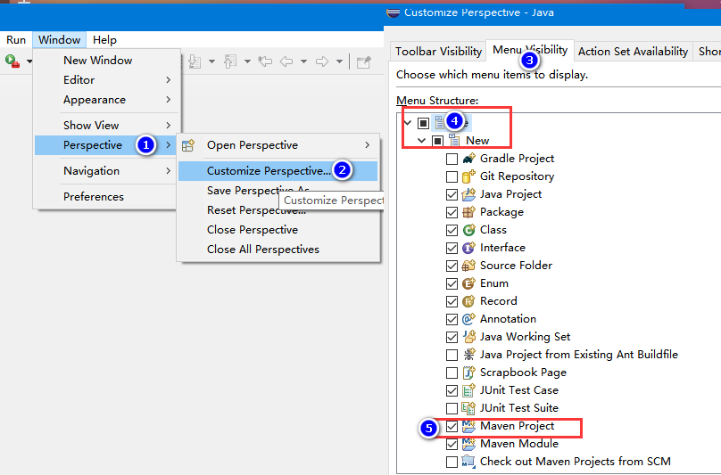

## jdk配置

```java
jdk 的位数和 eclipse 需要一致
```


## tomcat

```java
注意
    Eclipse里面限制Tomcat的最高版本是8.0的，
改用高版本的
    首先找到Tomcat的本地安装路径，然后找到lib文件夹中的catalina.jar包，用解压软件打开这个jar包，
    依次找到并且双击打开catalina.jar\org\apache\catalina\util\ServerInfo.properties文件
    // 将文件中server.info=Apache Tomcat/8.5.38中的8.5.38改成8.0.0即可。 再配置即可
    
    
window -- preferrence -- server -- runtime environmet  
    add -- 没有 apach 目录的， 先 search ， 把 tomcat 的安装目录加进来，然后再点 apach
    
```





## maven

### 安装







### 新建




## 参考

* https://blog.csdn.net/m0_46132054/article/details/111699342