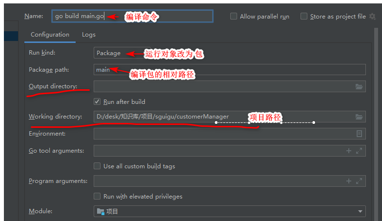

*   同一个包下不同文件不能相互调用函数

    *   原因

        ```go
        在 run/debug configurations 设置中run kind(运行类型)选择了File(文件)类型，在运行go程序时，只会编译指定文件(main.go)，其他文件不会编译，所以main.go不能调用其他文件的函数，导致报错
        
        就是编译的时候，只编译 main.go
        Go 中 main 包默认不会加载其他文件， 而其他包都是默认加载的。如果 main 包有多个文件，则在执行的时候需要将其它文件都带上，即执行 go run *.go。
        ```

    *   方法一

        ```go
        client 
        	- main.go
        	- client.go
        
        在 main 所在的文件夹中运行所有的文件
        	go run *.go	
        ```

    *   方法二

        ```go
        // 貌似有的时候不灵
        
        run  -- edit configuration -- run kind(运行类型) -- package
        
        package path为main，即src源文件夹下的main包的相对路径(相对于源文件夹src)
        
        https://blog.csdn.net/rainbowmin/article/details/103034729
        
        ```

        




