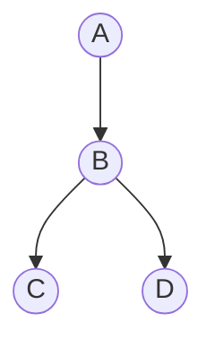

## 树

```go
​```mermaid
graph TB
A((A))
B((B))
C((C))
D((D))
E((E))
F((F))
G((G))
H((H))
I((I))
J((J)) 
K((K))
A-->B
A-->C
A-->D
E-->F
G-->H
G-->
I-->J
​```
```



```mermaid
graph TB
A((A))
B((B))
C((C))
D((D))
A-->B
B-->C
B-->D
```

