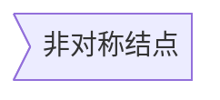
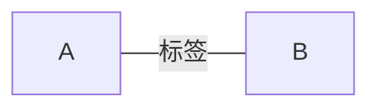
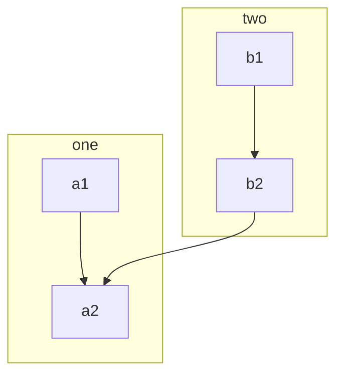

# 介绍
```go
// 图有很多种
1. mermaid
	flowchat
	graph

2. flow
```

# 流程图

### 结点模块

```go
// 模块定义，
// (模块标识与模块名称可以任意定义名称，但是不能为关键词)
模块标识(相当于变量名)=>模块关键词: 模块名称(模块中显示的文字)

// id 是当前节点名字，类似于变量名，画图时便于引用

A   		// 方形

id[A]		// 方形 , 就是文本结点
id(A)   	// 圆角方形
id((A)) 	// 原型

id>A]        // 非对称结点
id{A} 		// 菱形
```




### 连接线

```go
// 实线连接
A --> B    // 实线箭头指向 B
A --- B    	// 实线无箭头

A -- 标签 --- B    // 实现无箭头，加上标签，(注意前面是两个横线)
A -- 标签 --->   //实线右箭头，加上标签
A -->|标签| B


// 虚线连接
A -.-> B  //  指向 B
A -.- B    // 无指向

A -.标签.- B  // 无箭头，带标签
A -.标签.-> B  // 带箭头，指向B，带标签

// 粗实线连接
A ==> B 带箭头，指向B   
A == B  无箭头
A ==标签==> B  带标签，指向 B
A ==标签== B  带标签，无指向


```




### mermaid graph

*   格式

    ```go
    // 使用
    	这个需要 结点模块 + 连接线
    
    // T = top，B = bottom，L = left，R = right，D = down
    TB，从上到下
    TD，从上到下
    BT，从下到上
    RL，从右到左
    LR，从左到右
    
    
    ​```mermaid
    graph LR  // 横向流程图
    graph TB  // 竖向流程图
    
    代码块
    
    ​```
    ```

*   代码块

    ```go
    ​```memaid
    graph LR
    
    A --> B --> C
    
    ​```
    ```

    

    ```mermaid
    graph LR
    A --> B  --> C
    ```

*   flowchat

    ```go
    // 这个 typora 貌似不支持，但是 CSDN 支持
    // 代码块跟 flow 是一样的 
    ​```mermaid
    
    flowchat
    代码块
    
    ​```
    ```

    

### mermaid flowchat

*   官网

    ```go
    http://flowchart.js.org/
    https://creately.com/blog/diagrams/flowchart-guide-flowchart-tutorial/
    https://blog.csdn.net/suoxd123/article/details/84992282
    ```

*   语法结构

    ```go
    ​```mermaid
    	flowchat
    	定义节点
    	连接节点
    	（样式调整）
    ​```
    ```

*   定义元素

    ```go
    变量名=>节点标识: 节点显示名
    tag=>type: content:>url
    
    tag：标签，用于连接元素时使用
    type：该标签的类型。
    content：流程语句中放置的内容
    	type:与content之间一定要有一个空格，否则会出问题
    url：链接，与流程语句绑定
    ```

*   连接

    ```go
    // 连接符
    ->
    变量名1->变量名2->...->变量名n
    
    
    // 连接样式
    // 设置变量m和变量n之间连线的样式，具体样式由变量n后面key-value控制，需要两个变量之间有直接连线。
    // 语法中的连接符为（@>）
    变量名m@>变量名n({"key":"value"})
    ```

    

*   关键字 / 结点类型

    ```go
    开始（椭圆形）：start
    结束（椭圆形）：end
    操作（矩形）：operation
    多输出操作（矩形）：parallel
    条件判断（菱形）：condition
    输入输出（平行四边形）：inputoutput
    预处理/子程序（圣旨形）：subroutine
    
    start / end，表示程序的开始与结束
    operation，表示程序的处理块
    subroutine，表示子程序块
    condition，表示程序的条件判断
    input  / output，表示程序的出入输出
    
     
    yes/true：condition类型变量连接时，用于分别表示yes条件的流向
    no/false：同上，表示否定条件的流向
    	表示condition判断的分支(可以和right，left同时使用, , 需要和 condition 连用)
    
    left/right：表示连线出口在节点位置（默认下面是出口），可以跟condition变量一起用：cond(yes,right)
    path1/path2/path3：parallel变量的三个出口路径（默认下面是出口）
    ```

*   结点状态

    ```go
    // 为节点设置不同的状态
    past
    current
    future
    approved
    rejected
    invalid
    ```

    

*   格式
    *   flow

    ```go
    // 使用
    	这个需要 结点模块 + 连接线 + 关键字 
    
    ​```flow
    
    代码块
    
    ​```
    ```
    

*   标准流程图

```go
// 后续需要理解的代码
flowchat
st=>start: 开始
e=>end: 结束
op1=>operation: 操作1 | past
op2=>operation: 操作2 | current
op3=>operation: 操作3 | future
pa=>parallel: 多输出操作4 | approved
cond=>condition: 确认？ | rejected
	
st->op1->cond
cond(true)->e	
cond(no)->op2(right)->op3->pa(path1,right)->op1
pa(path2,left) ->e
st@>op1({"stroke":"Blue"})@>cond({"stroke":"Green"})@>e({"stroke":"Red","stroke-width":6,"arrow-end":"classic-wide-long"})


st=>start: Start|past:>http://www.baidu.com
e=>end: End:>http://www.baidu.com
op1=>operation: My Operation|past
op2=>operation: Stuff|current
sub1=>subroutine: My Subroutine|invalid
cond=>condition: Yes or No?|approved:>http://www.baidu.com
c2=>condition: Good idea|rejected
io=>inputoutput: catch something...|request

st->op1(right)->cond
cond(yes, right)->c2
cond(no)->sub1(left)->op1
c2(yes)->io->e
c2(no)->op2->e
```


```go
​```flow
# 先自定义变量,然后画图

st=>start: 开始   				# 开始框
e=>end: 结束					    # 结束框
op=>operation: 输入x				# 处理框
sub1=>subroutine: 是否重新输入 	  # 子流程
cond1=>condition: x>0?             # 判断框(是或否?)
cond2=>condition: yes/no 
io=>inputoutput: 输出x        	 # 输入输出框

st(right)->op->cond1
cond1(yes)->io(right)->e
cond1(no)->sub(right)->cond2()
cond2(yes, right)->op
cond2(no)->e

​```


# 指定方向,如果后面占用了这个方向, 前面的无效   
cond1(yes,right)->module1
cond1(no)->moudle2

```

```flow
#地方

graph LR
st=>start: 开始
e=>end: 结束
op=>operation: 输入x
sub=>subroutine: 是否重新输入
cond1=>condition: x>0?
cond2=>condition: yes/no 
io=>inputoutput: 输出x  

st(right)->op->cond1
cond1(yes)->io(right)->e
cond1(no)->sub(right)->cond2()
cond2(yes, right)->op
cond2(no)->e
```

### 抑制特殊字符

*   双引号

    ```go
    比如使用 id[dfa(dfs)fsf] 这样子会出现错误，所以使用 双引号
    
    // 双引号相当于 转义字符
    id["dfa(dfs)fsf"]
    ```

    

*   html 字符的转义字符

    ```go
    A["A double quote:#quot;"] --> B["A dec char:#9829;"]
    ```

# 子图

### 基础

```go 
// 结点模块 连接线 使用流程图的
subgraph
```

### mermaid

```go
​```mermaid

graph TB
代码块

​```
```

### 代码块

```go
graph TB
	subgraph one  // one 是子图名称
	a1 --> a2
	end			 // 子图结束。配套使用
	subgraph two
	b1 --> b2
	end
	b2 --> a2
```




# UML 时序图

### 基础

```go
sequence diagram
```

### 关键字

```go

```

### sequence

### mermaid sequenceDiagram

## 参考

```go
1. https://blog.csdn.net/whatday/article/details/88655461#subgraph%EF%BC%88%E5%AD%90%E5%9B%BE%EF%BC%89
2. https://www.jianshu.com/p/7ddbb7dc8fec
```


  


