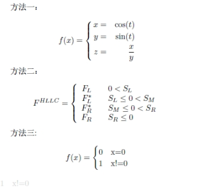

## 大括号



```
\documentclass{article}
\setlength\textwidth{245.0pt}
\usepackage{CJK}
\usepackage{indentfirst}
\usepackage{amsmath}

\begin{CJK*}{GBK}{song}
\begin{document}
方法一：

$$ f(x)=\left\{
\begin{aligned}
x & = & \cos(t) \\
y & = & \sin(t) \\
z & = & \frac xy
\end{aligned}
\right.
$$


方法二：

$$ F^{HLLC}=\left\{
\begin{array}{rcl}
F_L       &      & {0      <      S_L}\\
F^*_L     &      & {S_L \leq 0 < S_M}\\
F^*_R     &      & {S_M \leq 0 < S_R}\\
F_R       &      & {S_R \leq 0}
\end{array} \right. $$

方法三:

$$f(x)=
\begin{cases}
0& \text{x=0}\\
1& \text{x!=0}
\end{cases}$$

\end{CJK*}
\end{document}
```