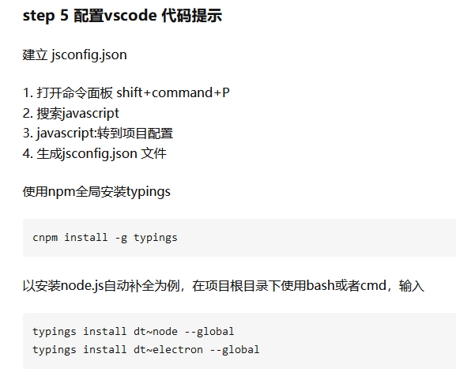

## 没有搞出来

## 


## electron 配置

```java
// 找到 相关的 electron.d.ts 文件
	C:\Users\11940\AppData\Roaming\npm\node_modules\electron\electron.d.ts
// 将这个文件放到你 项目中的 node_modules 文件目录中        
        
        
        
// 方式二
npm config list  // 找不到， 说明有问题        
        
```

