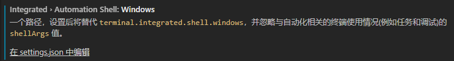

## 插件

### 普通插件

```java
idea互通
	IntelliJ IDEA Keybindings  插件
    
中文插件
chinese (simplified) language pack for visual studio code    
    
面包屑 breadcrumb
	导航路径 显示文件路径     
```

### 终端配置

```java
设置
    在终端中往下拉， 找到下面这个

注意1
    在工作区范围中进行设置时，某些终端设置不会自动起作用，
    您必须通过terminal.integrated.allowWorkspaceConfiguration在用户设置中将设置设置为true来授予它们运行权限。

    
前期
	"terminal.integrated.shell.windows": "E:\\git\\Git\\Git\\bin\\bash.exe",
    "terminal.integrated.tabs.enabled": false,    是否显示 tab
 后期
   "terminal.integrated.profiles.windows": {
        "PowerShell": {
            "source": "PowerShell",
            "icon": "terminal-powershell"
        },
        "Command Prompt": {
            "path": [
                "${env:windir}\\Sysnative\\cmd.exe",
                "${env:windir}\\System32\\cmd.exe"
            ],
            "args": [],
            "icon": "terminal-cmd"
        },
        "Windows PowerShell": {
            "path": "C:\\WINDOWS\\System32\\WindowsPowerShell\\v1.0\\powershell.exe"
        },
       
       需要新建一个，自带的哪个有一个  source 可能不太顶用
        "bash": {
            "path": "E:\\git\\Git\\Git\\bin\\bash.exe"
        }
    },
    "terminal.integrated.defaultProfile.windows": "bash",   // 默认的bash
    "terminal.integrated.allowWorkspaceConfiguration": true,     
```



### typing


```java
介绍
    vscode 的默认只有es原声api带有自动补全的功能，现在V1.9的版本默认已经支持NodeJS的智能补全。
    如果想获取jquery，nodejs，Requirejs，express等更多的提示扩展就需要使用Typings工具
    
安装
    npm install -g typings
版本检测
    typings --version
    
插件安装
    // https://github.com/DefinitelyTyped/
    // $ npm install  @types/node  --global
    typings install dt~node --global --save
    typings install dt~electron --global
    
    typings install dt~express --global
    typings install dt~lodash --global    


    
    
// 常用命令    
# 安装Typings的命令行代码. 
npm install typings --global

# 搜索对应模块的typings定义. 
typings search tape

# 根据名称寻找一个可获得的typings定义. 
typings search --name react

# 如果你用一个独立包的模块: 
# 或者并不是安装全局模块
# 比如并不是在命令行通过输入npm install -g typings这种方式安装的. 
typings install debug --save

# 如果是通过script标记
# 或者是子环境的一部分
# 或者全局typings命令不可用的时候： 
typings install dt~mocha --global --save

# 从其他版本处安装typings定义(比如env或者npm). 
typings install env~atom --global --save
typings install npm~bluebird --save

# 使用该文件`typings/index.d.ts` (在`tsconfig.json`文件使用或者用 `///` 定义). 
cat typings/index.d.ts

                             
                                                          
```

